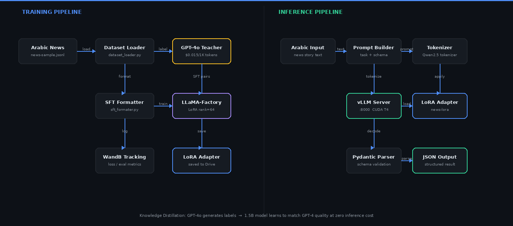

# ArabicLLM

**Fine-tuning a 1.5B model to match GPT-4 quality on Arabic news NLP — at zero inference cost.**

Built a complete pipeline: dataset generation with GPT-4o as teacher, LoRA fine-tuning via LLaMA-Factory, production serving with vLLM, and a live Streamlit inference UI with token streaming.

---

## The Problem

Arabic news NLP requires extracting structured data — titles, keywords, summaries, named entities, categories — reliably from unstructured text. GPT-4o does this well but costs money at scale and can't be self-hosted.

**The approach:** use GPT-4o once to generate high-quality labeled data, then fine-tune a 1.5B model on that data. The result is a self-hosted model that produces the same structured output as GPT-4o on this specific task, at zero per-request cost.

---

## Architecture

<p align="center">
  
</p>

Two distinct phases:

**Training** — GPT-4o labels raw Arabic news stories. Those labels are formatted into SFT pairs and used to fine-tune Qwen2.5-1.5B with LoRA adapters via LLaMA-Factory. Training is tracked on Weights & Biases.

**Inference** — Arabic text goes through a prompt builder, gets tokenized with the Qwen2.5 tokenizer, and is sent to a vLLM server with the LoRA adapter hot-loaded. Output is validated against a Pydantic schema and returned as structured JSON.

---


## Fine-tuning Pipeline

### 1. Generate labeled data with GPT-4o

Raw Arabic news stories go in. GPT-4o returns structured JSON following a Pydantic schema.

```python
python -m scripts.generateSFT
```

Output per record:
```json
{
  "id": 1,
  "story": "ذكرت مجلة فوربس أن العائلة تلعب دورا محوريا...",
  "task": "details_extraction",
  "response": {
    "story_title": "دور العائلة في تشكيل الشخصية المالية",
    "story_keywords": ["المال", "العائلة", "فوربس"],
    "story_summary": ["العائلة تؤثر على علاقة الأفراد بالمال"],
    "story_category": "economy",
    "story_entities": [
      { "entity_value": "فوربس", "entity_type": "organization" }
    ]
  }
}
```

### 2. Format for LLaMA-Factory

```python
python -m scripts.build_dataset
```

Produces `train.json` and `val.json` in the LLaMA-Factory SFT format.

### 3. Register the dataset

In `LLaMA-Factory/data/dataset_info.json`:

```json
{
  "news_finetune_train": {
    "file_name": "/path/to/train.json",
    "columns": {
      "prompt": "instruction",
      "query": "input",
      "response": "output",
      "system": "system",
      "history": "history"
    }
  },
  "news_finetune_val": {
    "file_name": "/path/to/val.json",
    "columns": {
      "prompt": "instruction",
      "query": "input",
      "response": "output",
      "system": "system",
      "history": "history"
    }
  }
}
```

### 4. Train with LoRA

```bash
cd LLaMA-Factory/
llamafactory-cli train examples/train_lora/news_finetune.yaml
```

```yaml
model_name_or_path: Qwen/Qwen2.5-1.5B-Instruct
finetuning_type: lora
lora_rank: 64
lora_target: all
dataset: news_finetune_train
val_dataset: news_finetune_val
num_train_epochs: 3
learning_rate: 2.0e-4
```

Training runs on Weights & Biases:
[Run 1](https://wandb.ai/mr-bakrianoo/llamafactory/runs/apwbkni9) · [Run 2](https://wandb.ai/mr-bakrianoo/llamafactory/runs/c5tf0q90)

---

## Serving with vLLM

### Install

```bash
pip install vllm==0.6.6 transformers==4.45.2 numpy==1.26.4
```

### Start server

```bash
python -m vllm.entrypoints.openai.api_server \
  --model Qwen/Qwen2.5-1.5B-Instruct \
  --served-model-name arbic_llm \
  --enable-lora \
  --lora-modules arbic_llm=/path/to/adapter \
  --dtype=float16 \
  --gpu-memory-utilization 0.90 \
  --max_lora_rank 64 \
  --max-model-len 4096 \
  --enforce-eager
```

> Running on NVIDIA T4 (sm\_75). FlashAttention2 requires sm\_80+, so xFormers backend is used with `--enforce-eager`.

### Call the API

```python
import requests

response = requests.post("http://localhost:8000/v1/completions", json={
    "model": "arbic_llm",
    "prompt": prompt,
    "max_tokens": 500,
    "temperature": 0.3,
    "stream": True
})
```

### Run the UI

```bash
streamlit run app/streamlit_app.py --server.port 8501
```

---

## Load Testing

20 concurrent users, 60 seconds, Arabic fake text generated per request:

```bash
locust --headless -f locust.py \
  --host=http://localhost:8000 \
  -u 20 -r 1 -t "60s" \
  --html=locust_results.html
```

Token analysis after test:

```python
from src.inference.tokenizer_utils import summarize_token_log

stats = summarize_token_log("vllm_tokens.txt", "Qwen/Qwen2.5-1.5B-Instruct")
# → {"records": N, "total_input_tokens": X, "total_output_tokens": Y}
```

---

## Output Schemas

**Details Extraction**
```json
{
  "story_title": "string (5–100 chars)",
  "story_keywords": ["string"],
  "story_summary": ["string (1–5 points)"],
  "story_category": "politics | sports | economy | health | technology | ...",
  "story_entities": [
    { "entity_value": "string", "entity_type": "person-male | person-female | organization | location | ..." }
  ]
}
```

**Translation**
```json
{
  "translated_title": "string",
  "translated_content": "string"
}
```

---

## Project Structure

```
ArabicLLM/
├── app/
│   └── streamlit_app.py          # Inference UI
├── src/
│   ├── data/
│   │   ├── BuildSTF.py           # Calls GPT-4o, saves SFT records
│   │   ├── dataset_loader.py     # JSONL loader
│   │   └── sft_formater.py       # LLaMA-Factory format converter
│   ├── models/
│   │   ├── base_model.py         # HuggingFace local inference
│   │   ├── finetunnig_model.py   # PEFT + LoRA local inference
│   │   ├── openai_model.py       # OpenAI-compatible API client
│   │   ├── http_model.py         # vLLM HTTP client
│   │   └── initialize_model.py   # Factory — returns any model type
│   ├── tasks/
│   │   ├── news_details_extraction_task.py
│   │   └── translation_task.py
│   ├── schemas/
│   │   ├── news_schema.py        # Pydantic NewsDetails
│   │   └── translate_schema.py   # Pydantic TranslatedStory
│   ├── inference/
│   │   ├── vllm_client.py
│   │   └── tokenizer_utils.py
│   └── load_testing/
│       ├── locust_runner.py
│       └── token_analyzer.py
├── scripts/
│   ├── generateSFT.py            # Entry point: build dataset
│   ├── build_dataset.py          # Format + split
│   └── tasksevalution.py         # Run and evaluate tasks
└── data/
    └── DataSet/
        ├── news-sample.jsonl
        └── sft_details_extraction.jsonl
```

---

## Skills

**LLM Fine-tuning** — LoRA (PEFT), SFT data generation, LLaMA-Factory, knowledge distillation, Weights & Biases experiment tracking

**Production Serving** — vLLM, LoRA adapter hot-loading, GPU memory optimization, streaming inference (SSE), OpenAI-compatible API

**NLP** — Arabic language, structured output extraction, named entity recognition, multilingual translation, prompt engineering with schema injection

**Engineering** — Pydantic v2, factory pattern, JSONL pipelines, json-repair for malformed LLM outputs, load testing with Locust

**Infrastructure** — CUDA (T4 / sm\_75), xFormers attention backend, Google Colab, ngrok tunneling, Streamlit

---

## Stack

| | |
|---|---|
| Base model | Qwen/Qwen2.5-1.5B-Instruct |
| Fine-tuning | LLaMA-Factory · LoRA rank 64 |
| Teacher model | GPT-4o |
| Serving | vLLM 0.6.6 |
| UI | Streamlit |
| Tracking | Weights & Biases |
| GPU | NVIDIA T4 · 15GB VRAM |
| Language | Python 3.12 |

---

## Numbers

| Metric | Value |
|---|---|
| GPU VRAM used | 11.9 / 15.0 GB |
| Avg inference latency (T4) | ~14s |
| Max context length | 4096 tokens |
| Load test users | 20 concurrent |
| LoRA rank | 64 |